# Hi 👋, I'm Marcelo Roberto Jimenez

<!-- markdownlint-capture -->

## An electronics engineer from Brazil

---

### Media, not necessarily social

<!-- Hi there 👋 -->

<!-- markdownlint-disable MD033  -->

<!-- 

-->

  

### Languages and Tools

| | A | B | C | D | E | F |
| --- | --- | --- | --- | --- | --- | --- |
| 1 |  |  |  |  |  |  |
| 2 |  |  |  |  |  |  |
| 3 |  |  |  |  |  |  |
| 4 |  |  |  |  |  |  |
| 5 |  |  |  |  |  |  |
| 6 |  |  |  |  |  |  |

<!-- markdownlint-restore -->

---

### 📘 Latest Blog Posts

<!-- BLOG-POST-LIST:START -->
- [Stop IPTables and Other Kernel Messages From Flooding Your Console](https://eeandcs.blogspot.com/2017/10/stop-iptables-and-other-kernel-messages.html)
- [Google chrome version 62.0.3202.62 is not working for me](https://eeandcs.blogspot.com/2017/10/google-chrome-version-620320262-is-not.html)
- [Why is ssh slow to connect?](https://eeandcs.blogspot.com/2016/10/why-is-ssh-slow-to-connect.html)
- [OpenSUSE Leap 42.1 and nvidia kernel driver](https://eeandcs.blogspot.com/2016/08/opensuse-leap-421-and-nvidia-kernel.html)
- [Arduino Shield for custom board CPLD programming and testing using pogo pins](https://eeandcs.blogspot.com/2016/03/arduino-shield-for-custom-board-cpld.html)
<!-- BLOG-POST-LIST:END -->

---

### :zap: Recent Activity

<!--START_SECTION:activity-->
1. 🗣 Commented on [#432](https://github.com/amule-project/amule/pull/432#issuecomment-4230388757) in [amule-project/amule](https://github.com/amule-project/amule)
2. 🗣 Commented on [#442](https://github.com/amule-project/amule/issues/442#issuecomment-4223092214) in [amule-project/amule](https://github.com/amule-project/amule)
3. 🔒 Closed issue [#442](https://github.com/amule-project/amule/issues/442) in [amule-project/amule](https://github.com/amule-project/amule)
4. 🗣 Commented on [#432](https://github.com/amule-project/amule/pull/432#issuecomment-4218250402) in [amule-project/amule](https://github.com/amule-project/amule)
5. 🗣 Commented on [#432](https://github.com/amule-project/amule/pull/432#issuecomment-4218193079) in [amule-project/amule](https://github.com/amule-project/amule)
<!--END_SECTION:activity-->

---

<!--

-->

<!--

-->

<!--
**mrjimenez/mrjimenez** is a ✨ _special_ ✨ repository because its `README.md` (this file) appears on your GitHub profile.

Here are some ideas to get you started:

- 🔭 I’m currently working on ...
- 🌱 I’m currently learning ...
- 👯 I’m looking to collaborate on ...
- 🤔 I’m looking for help with ...
- 💬 Ask me about ...
- 📫 How to reach me: ...
- 😄 Pronouns: ...
- ⚡ Fun fact: ...
-->

<!--
https://www.youtube.com/watch?v=ECuqb5Tv9qI&t=867s
https://www.youtube.com/watch?v=n6d4KHSKqGk&t=986s
https://www.youtube.com/watch?v=TsaLQAetPLU&t=227s
https://emojipedia.org/search/?q=book
https://rahuldkjain.github.io/gh-profile-readme-generator/

-->
